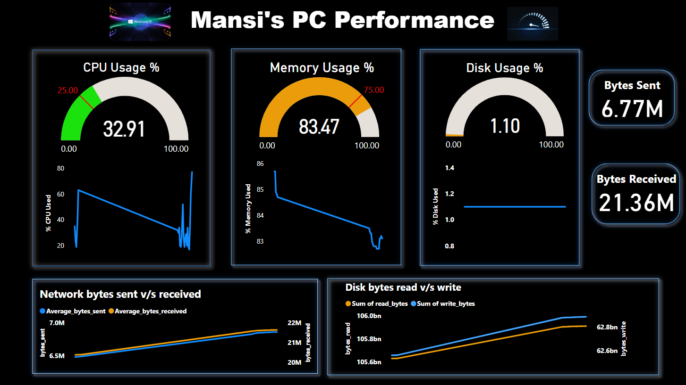

# Windows Health Monitoring

Windows Health Monitoring is a real-time system monitoring project that tracks and visualizes key performance metrics on a Windows machine.



## Features

- Real-time monitoring of CPU, memory, network, and disk.
- Data collection using Python and psutil library.
- Storage of metrics in MySQL database.
- Visualization of insights through Power BI, using DAX for creating a dashboard named "Mansi's PC Performance."

## Prerequisites

Before you begin, ensure you have met the following requirements:

- Python 3.11
- MySQL database
- Power BI Desktop

### How to Use

1. Clone the repository:

   ```bash
   git clone https://github.com/htcmansi/Windows_Health_Monitoring.git
   ```

2. Install the required Python dependencies:
    ```bash
    pip install -r requirements.txt
    ```
3. Set up the MySQL database using the schema in the [Database/WHM.sql](Database/WHM.sql) file.

4. Run the data collection script:

    ```bash
    python main.py
    ```
    This will start collecting metrics and storing them in the MySQL database.

5. Open the Power BI file [PowerBI/PC_Performance.pbix](PowerBI/PC_Performance.pbix) to visualize the performance metrics in real-time.

## Usage

1. Start the monitoring script to collect real-time data.

2. Access Power BI to visualize the collected metrics.

3. Analyze the insights for efficient system performance.
